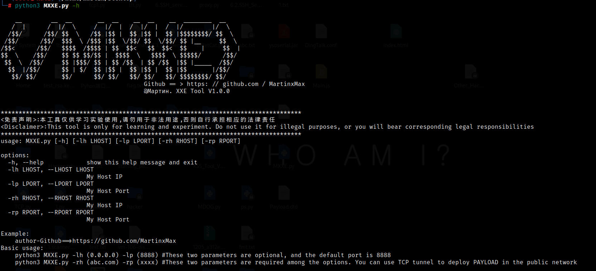

 <div align="center">
 
 <p align="center">
 
 
 
  
 
 
 </p>
  
 <table>
  <tr>
      <th>Function</th>
  </tr>
  <tr>
    <th>XXE vulnerability data receiver</th>
  </tr>
 </table>
</div>

# usage method

```#python3 MXXE.py -h```

   

## practice

1.Port scan

 

2.Mining to robots file


3.Determine XML format transmission and detect XXE vulnerability

 
 
4.Run tool(Use TCP tunnel for public network deployment)

 
 
5.The server parses the XML code and determines that there is an XXE entity vulnerability

--We got the file content on the server

 

6.After decryption, PHP executes to get Flag

 

